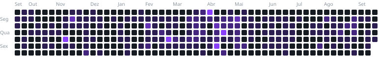

  
  

Desenvolvedor full stack, com TypeScript do banco à interface: React e Next.js no front, Node e NestJS no back.
Me importo com o que acontece depois do deploy: código tipado, testado e fácil de entender para quem pegar depois.

Hoje trabalho com sistemas de gestão tributária, onde regra de negócio complexa e dado confiável não são opcionais.

### Stack

  
   
  
   
  
   
  

### Atividade

  
  

